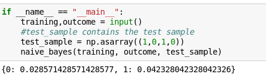

# Naive Bayes
Implementation of Naive Bayes from scratch using pandas and numpy.
## Introduction
It is a classification technique based on Bayes’ Theorem with an assumption of independence among predictors. In simple terms, a Naive Bayes classifier assumes that the presence of a particular feature in a class is unrelated to the presence of any other feature.
## Assumption:
The fundamental Naive Bayes assumption is that each feature makes an independent and equal contribution to the outcome.
## Bayes Theorem
Bayes Theorem finds the probability of an event occurring given the probability of another event that has already occurred. Bayes’ theorem is stated mathematically as the following equation:  

## Assumption:
The fundamental Naive Bayes assumption is that each feature makes an independent and equal contribution to the outcome. 
For example, the temperature being ‘Hot’ has nothing to do with the humidity or the outlook being ‘Rainy’ has no effect on the winds. Hence, the features are assumed to be independent.Each feature is given the same weight(or importance). For example, knowing only temperature and humidity alone can’t predict the outcome accuratey. None of the attributes is irrelevant and assumed to be contributing equally to the outcome.
## Result

